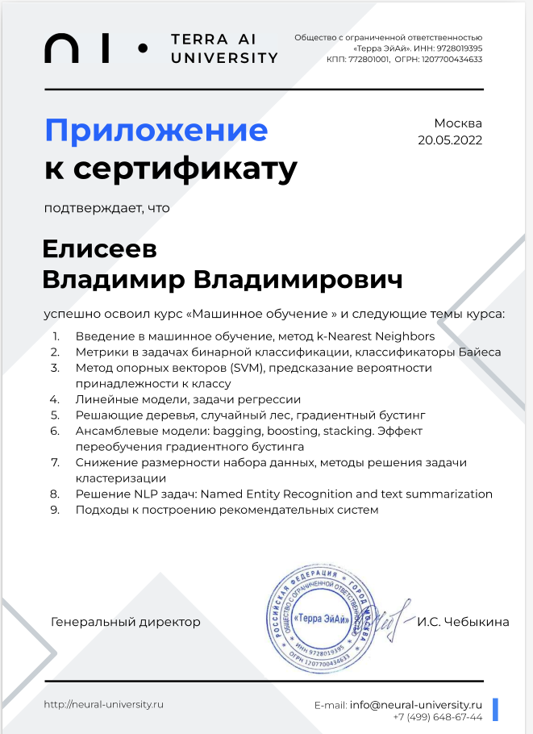
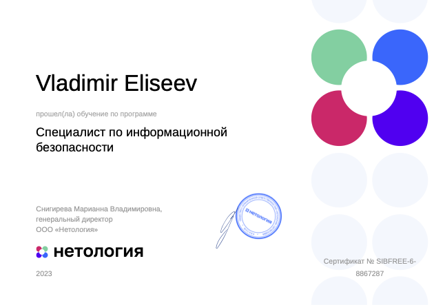

  

- 🔭 I'm currently working as go developer.
- 🌱 I'm currently learning artificial intelligence.
- 👯 I'am looking forward to cooperation in trading or cryptocurrency.
- 📫 How to reach me: yvv4recon@gmail.com
- 💻 My leetcode profile: https://leetcode.com/VladimirEliseev/

# My stats

# 🛠 &nbsp;Languages and Tools :

&nbsp;
&nbsp;
&nbsp;
&nbsp;
&nbsp;
&nbsp;
&nbsp;
&nbsp;
&nbsp;
&nbsp;
&nbsp;
&nbsp;
&nbsp;
&nbsp;
&nbsp;
&nbsp;
&nbsp;

# Buy me a coffee
<table>
  <tr>
    <td>Tether trc20</td>
    <td>Bitcoin</td>
  </tr>
  <tr>
    <td></td>
    <td></td>
  </tr>
  <!-- <tr>
    <td></td>
  </tr>
  </tr>
    <tr>
    <td></td>
  </tr> -->
</table>
